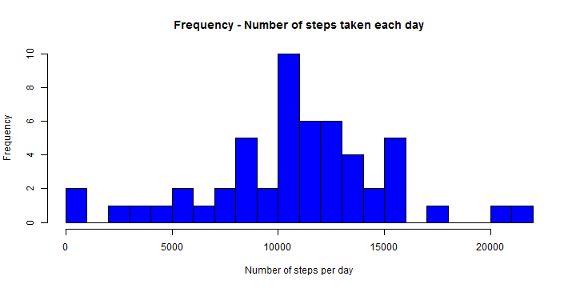
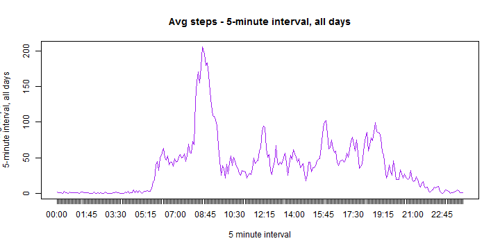
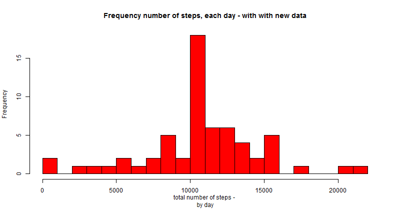
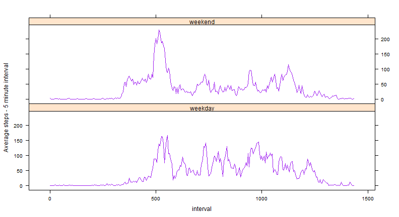

Peer Asessment - Reproducible Research Activity Data Monitoring Analysis
========================================================

## Data
Data package is in folder: repdata-data-activity, file name: activity
Original source of data: https://d396qusza40orc.cloudfront.net/repdata%2Fdata%2Factivity.zip

The variables included in this dataset are (from PA assignment page):

steps: Number of steps taking in a 5-minute interval (missing values are coded as NA)

date: The date on which the measurement was taken in YYYY-MM-DD format

interval: Identifier for the 5-minute interval in which measurement was taken

The dataset is stored in a comma-separated-value (CSV) file and there are a total of 17,568 observations in this dataset.

##Step 1: Loading and preprocessing the data

Load the data into R


```r
ActivityData <- read.csv("C:/Users/Brandon/Downloads/repdata-data-activity/activity.csv")
head(ActivityData,20)
```

```
##    steps       date interval
## 1     NA 2012-10-01        0
## 2     NA 2012-10-01        5
## 3     NA 2012-10-01       10
## 4     NA 2012-10-01       15
## 5     NA 2012-10-01       20
## 6     NA 2012-10-01       25
## 7     NA 2012-10-01       30
## 8     NA 2012-10-01       35
## 9     NA 2012-10-01       40
## 10    NA 2012-10-01       45
## 11    NA 2012-10-01       50
## 12    NA 2012-10-01       55
## 13    NA 2012-10-01      100
## 14    NA 2012-10-01      105
## 15    NA 2012-10-01      110
## 16    NA 2012-10-01      115
## 17    NA 2012-10-01      120
## 18    NA 2012-10-01      125
## 19    NA 2012-10-01      130
## 20    NA 2012-10-01      135
```

Clean up the data and transform it for analysis


```r
ActivityData$date <- as.Date(ActivityData$date)
ActivityData$steps <- as.numeric(ActivityData$steps)
ActivityData$interval <- as.numeric(ActivityData$interval)
```

##Step 2: Getting the mean number of steps, per day

Histogram of number of steps taken each day


```r
Activitysum <- tapply(ActivityData$steps, ActivityData$date, sum, simplify = TRUE)
hist(Activitysum, breaks=18, col="blue", main = "Frequency - Number of steps taken each day", xlab = "Number of steps per day")
```

 

Report mean and median steps taken by day

Mean steps per day:

```r
mean(Activitysum, na.rm = TRUE)
```

```
## [1] 10766
```

Median steps per day:

```r
median(Activitysum, na.rm = TRUE)
```

```
## [1] 10765
```

##Step 3: Daily average activity  pattern

Create a time series plot with 5 minute interval on the x-axis and average number of steps on the y-axis


```r
AcAvg <- tapply(ActivityData$steps, ActivityData$interval, mean, simplify = TRUE, na.rm = TRUE)

x1 <- formatC(as.numeric(names(AcAvg)), width=4, flag="0")

x2 <- paste0(substr(x1,1,2),":",substr(x1,3,4))

x3 <- as.numeric(substr(x1,1,2))+as.numeric(substr(x1,3,4))/60

plot(x3, AcAvg, type = "l", col="purple", main = "Avg steps - 5-minute interval, all days", xlab = "5 minute interval", ylab = "Avg steps - 
5-minute interval, all days", xaxt = "n")
axis(1, x3, x2)
```

 

Average accross all days in the data - contain the maximum number of steps


```r
MaxAvg<-max(AcAvg, na.rm = TRUE)
x=names(MaxAvg)
y=MaxAvg
Ave = cbind(x,y)
MaxAvgSteps<-Ave[y == MaxAvg]
```

5 minute interval on accross all days in the data with the maximum number of steps is:


```r
MaxAvgSteps[1]
```

```
## [1] 206.2
```

##Step 4: Imputing missing values

Note that there are a number of days/intervals where there are missing values (coded as NA). The presence of missing days may introduce 
bias into some calculations or summaries of the data.

Calculate and report the total number of missing values in the dataset (i.e. the total number of rows with NAs)

```r
NASteps <- is.na(ActivityData$steps)
sum(NASteps)
```

```
## [1] 2304
```
Devise a strategy for filling in all of the missing values in the dataset. The strategy does not need to be sophisticated. For example, you 
could use the mean/median for that day, or the mean for that 5-minute interval, etc.

```r
#Using the mean for that 5-minute interval to replace NA of that interval in each day.
for (i in 1:length(AcAvg)) {
        ActivityData[(is.na(ActivityData$steps))&(ActivityData$interval==names(AcAvg)[i]),]$steps = AcAvg[i]
}
```

Create a new dataset that is equal to the original dataset but with the missing data filled in.

```r
NewData <- ActivityData
```
Make a histogram of the total number of steps taken each day and Calculate and report the mean and median total number of steps 
taken per day. Do these values differ from the estimates from the first part of the assignment? What is the impact of imputing missing 
data on the estimates of the total daily number of steps?

```r
Newsum <- tapply(NewData$steps, NewData$date, sum, simplify = TRUE)

hist(Newsum, breaks=20, col="red", main = "Frequency number of steps, each day - with with new data", xlab = "total number of steps - 
by day")
```

 

```r
mean(Newsum, na.rm = TRUE)
```

```
## [1] 10766
```

```r
median(Newsum, na.rm = TRUE)
```

```
## [1] 10766
```

##Step 5: Are there differences in activity patterns between weekdays and weekends?

Flagging each day of the week as being a week day or a weekend day


```r
ActivityData$weekday <- weekdays(as.Date(ActivityData$date), abbreviate = TRUE)

ActivityData$weekend <- ""

##ActivityData[grepl("Sun", ActivityData$weekday, ignore.case=TRUE) | grepl("Sat", ActivityData$weekday, ignore.case=TRUE),]$weekend 
##<- "weekend"

ActivityData[grepl("Mon", ActivityData$weekday, ignore.case=TRUE) | grepl("Tue", ActivityData$weekday, ignore.case=TRUE) | grepl
("Wed", ActivityData$weekday
, ignore.case=TRUE) | grepl("Thu", ActivityData$weekday, ignore.case=TRUE) | grepl("Fri", ActivityData$weekday, 
ignore.case=TRUE),]$weekend <- "weekday"
```

Create a plot containg time series data comparing weekdays to weekend days


```r
library(lattice)
ActivityData <- transform(ActivityData, weekend = factor(weekend))
AcAvgWeek <- tapply(ActivityData$steps, list(ActivityData$interval,ActivityData$weekend), mean, simplify = TRUE, na.rm = TRUE)
x1 <- formatC(as.numeric(rownames(AcAvgWeek)), width=4, flag="0")
x2 <- paste0(substr(x1,1,2),":",substr(x1,3,4))
x3 <- as.numeric(substr(x1,1,2))*60 + as.numeric(substr(x1,3,4))
AvgWd<-data.frame(ave = AcAvgWeek[,1], interval = c(x3), weekend = rep("weekday",288))
AvgWeek<-data.frame(ave = AcAvgWeek[,2], interval = c(x3), weekend = rep("weekend",288))
AvgWeek2<-rbind(AvgWd,AvgWeek)
AvgWeek2 <- transform(AvgWeek2, weekend = factor(weekend))
xyplot(ave~interval|weekend, data = AvgWeek2, type="l", col="purple", layout=c(1,2), ylab="Average steps - 5 minute interval")
```

 


